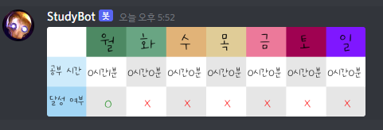

# READMD.md

# StudyBot

> 여러분의 디스코드 서버에 공부 봇을 초대해 더욱 효과적으로 공부하세요!
> 
- 디스코드 사용자들 간의 랭킹
- 공부시간, 휴식시간 기록
- 주간 공부시간 표

## 초대 방법

- URL

<aside>
💡 해당 링크를 통해 초대해주세요

[**https://discord.com/oauth2/authorize?client_id=931443212458020934&scope=bot**](https://discord.com/oauth2/authorize?client_id=%3CCLIENT_ID%3E&scope=bot)

</aside>

## 사용 예제

스크린 샷과 코드 예제를 통해

<aside>
💡 *더 많은 예제와 사용법은 
!help를 통해 참고하세요*

</aside>

## 업데이트 내역

- 0.0.0
    - 첫 출시

## 정보

DH.Kim - water_beetle@naver.com

YJ.Cho - slugl@naver.com

[https://github.com/yourname/github-link](https://github.com/dbader/)

## 기여 방법

1. ([https://github.com/yourname/yourproject/fork](https://github.com/yourname/yourproject/fork))을 포크합니다.
2. (`git checkout -b feature/fooBar`) 명령어로 새 브랜치를 만드세요.
3. (`git commit -am 'Add some fooBar'`) 명령어로 커밋하세요.
4. (`git push origin feature/fooBar`) 명령어로 브랜치에 푸시하세요.
5. 풀리퀘스트를 보내주세요.